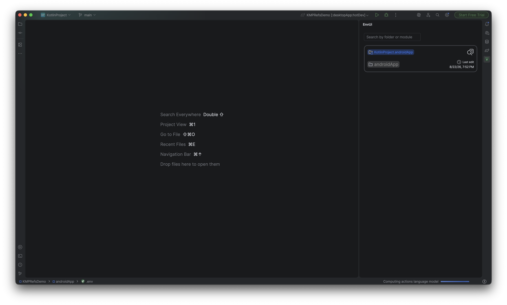
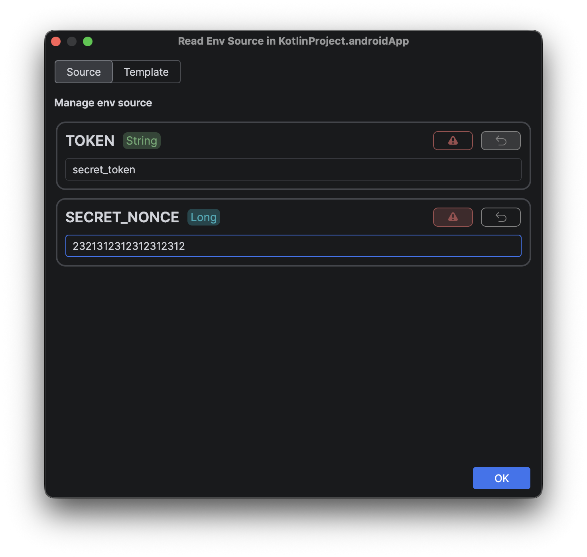
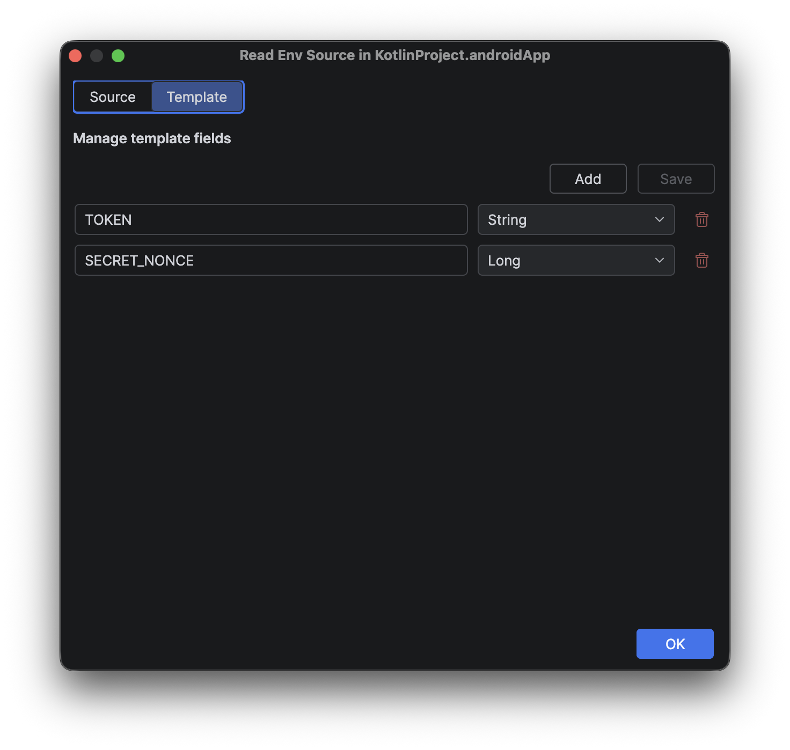
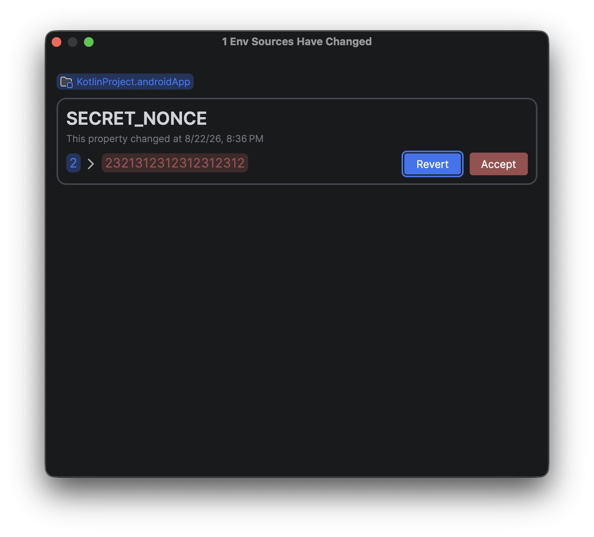

# EnvUi

**EnvUi** is a plugin for JetBrains's IDEs for managing environments variable in a more suitable way providing dedicated
UI to manage creation and variables persistence easily

## Core futures

### Faster sources navigation

With a dedicated panel in the IDE the sources will be easily to find across the whole project
and will be faster to access to the files and related templates

### Easier sources editing

With a dedicated dialog the properties of an env source file, and the related template, can be inserted, replaced or 
deleted easier providing information about each property type

<strong>Source</strong>

<strong>Template</strong>

### Properties lifecycle

#### Critical properties

Marking the environment variables as **critical**, when they change during a session, before to
close the IDE and that session will be shown a diff resolved dialog to accept the new value or restore
the previous one

#### Reset on close properties

Marking the environment variables as **require reset on close**, when they change during a session, before to
close the IDE and that session will be automatically restored with the initial value of the session

## Support

If you need help using the library or encounter any problems or bugs, please contact us via the following links:

- Support via <a href="mailto:infotecknobitcompany@gmail.com">email</a>
- Support via <a href="https://github.com/N7ghtm4r3/Pandoro/issues/new">GitHub</a>

Thank you for your help!

## Badges

## Privacy policy

This section outlines the privacy practices and policies governing the use of the EnvUi plugin, available through the JetBrains Marketplace.

EnvUi does not collect, store, share, or transmit personal data, usage information, performance reports, or diagnostic data.

Environment variables, configuration files, templates, preferences, and any other information accessed or managed through the plugin remain on the user’s local device and are never transmitted to external services.

EnvUi does not use analytics, tracking technologies, advertising services, or third-party data collection systems.

## Donations

If you want support project and developer

| Crypto                                                                                              | Address                                          | Network  |
|-----------------------------------------------------------------------------------------------------|--------------------------------------------------|----------|
|    | **3H3jyCzcRmnxroHthuXh22GXXSmizin2yp**           | Bitcoin  |
|  | **0x1b45bc41efeb3ed655b078f95086f25fc83345c4**   | Ethereum |
|        | **AtPjUnxYFHw3a6Si9HinQtyPTqsdbfdKX3dJ1xiDjbrL** | Solana   |

If you want support project and developer
with <a href="https://www.paypal.com/donate/?hosted_button_id=5QMN5UQH7LDT4">PayPal</a>

Copyright © 2026 Tecknobit